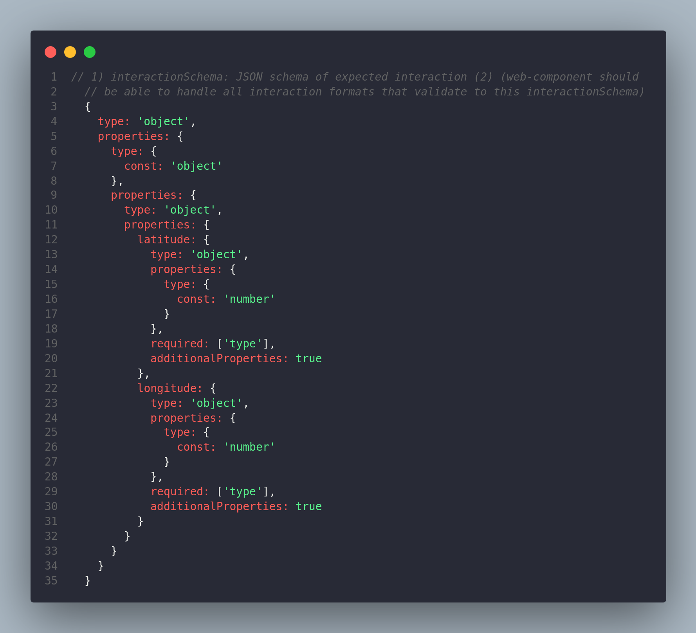
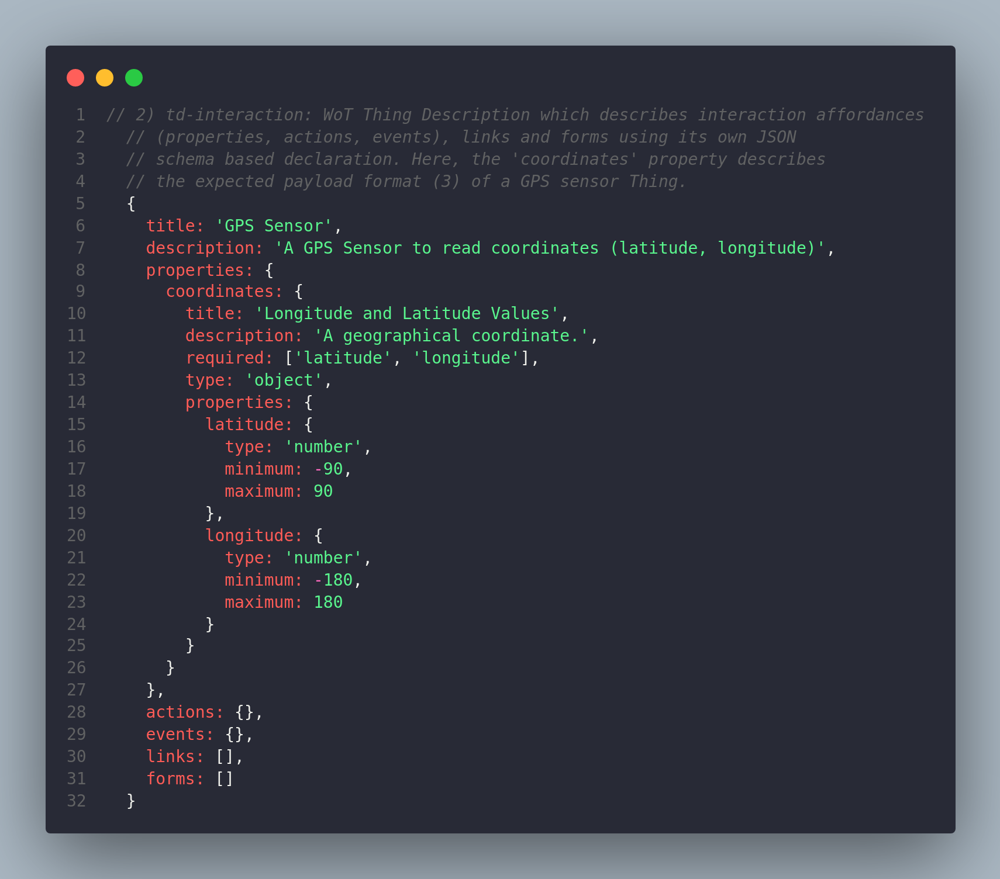
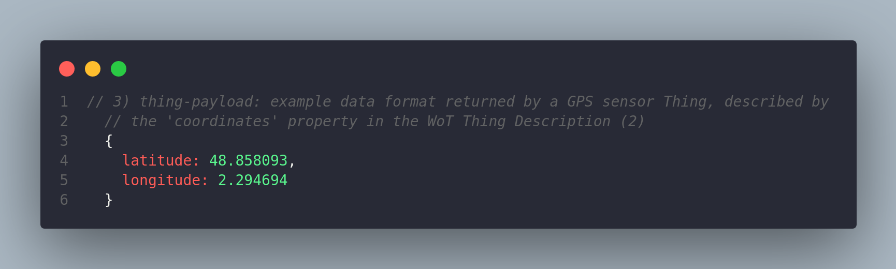

## Interaction Schema

**Widget plugins** expect a `wotSchema` at path `form.schema.wot` of their `plugin.json` files describing their expected WoT Thing Description (TD) interactions (properties, actions, events) forms and/or links at path. These are then used to select most proper widget when dragging-and-dropping WoT elements into dashboards, simplifying dashboard creation.

The `wotSchema` of each **widget** should describe **all** possible formats of expected WoT TD interactions (properties, actions, events), links and/or forms which the widget implements. Having said that, the widget plugin itself should be able to handle all formats described in its `wotSchema`. This methodology allows decoupling plugin business logic from the expected format. By doing so, development becomes easier and more maintainable, since widget authors must simply define what TD interaction formats their widget plugins can handle. Since widgets will only render when their `wotSchema` validates, widget plugin developers can be sure that their widgets will work. Additionally, if widget development continues and support for other formats is added, the authors only need to add the new formats to the `wotSchema` of their widgets.

The following 3 images give an overview of what is intended with the **wotSchema** as a means of describing format of expected TD interactions

    

    

    

