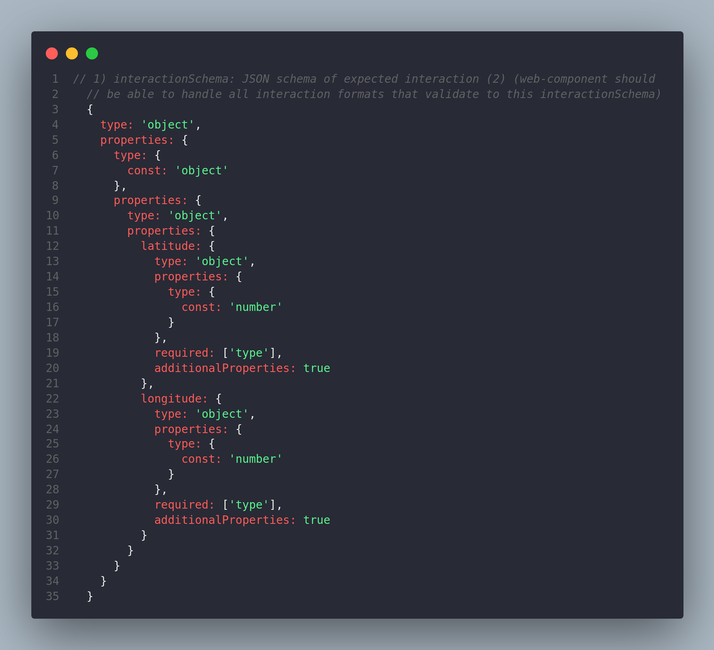
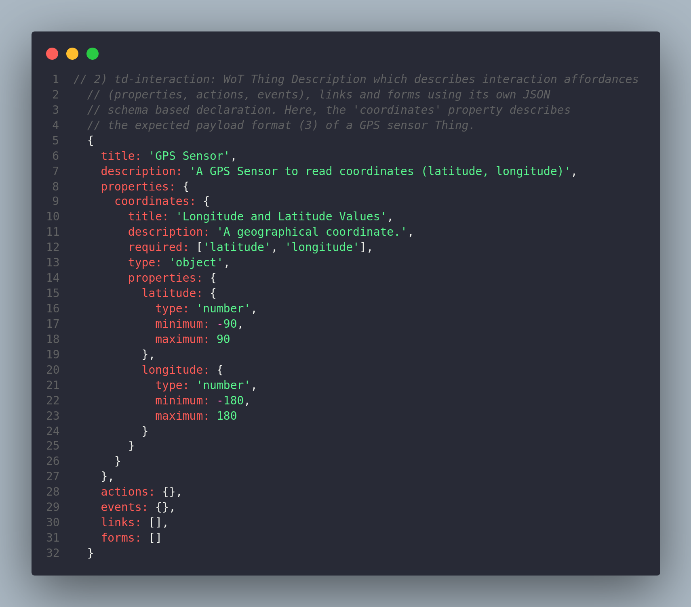
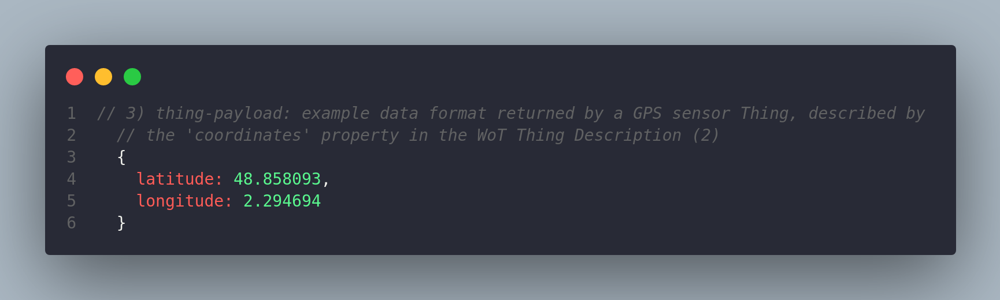

## Interaction Schema

**Component plugins** expect a `wotSchema` at path `form.schema.wot` of their `plugin.json` files describing their expected WoT Thing Description (TD) interactions (properties, actions, events) forms and/or links at path. These are then used to select most proper component when dragging-and-dropping WoT elements into dashboards, simplifying dashboard creation.

The `wotSchema` of each **component** should describe **all** possible formats of expected WoT TD interactions (properties, actions, events), links and/or forms which the component implements. Having said that, the component plugin itself should be able to handle all formats described in its `wotSchema`. This methodology allows decoupling plugin business logic from the expected format. By doing so, development becomes easier and more maintainable, since component authors must simply define what TD interaction formats their component plugins can handle. Since components will only render when their `wotSchema` validates, component plugin developers can be sure that their components will work. Additionally, if component development continues and support for other formats is added, the authors only need to add the new formats to the `wotSchema` of their components.

The following 3 images give an overview of what is intended with the **wotSchema** as a means of describing format of expected TD interactions

    

    

    

